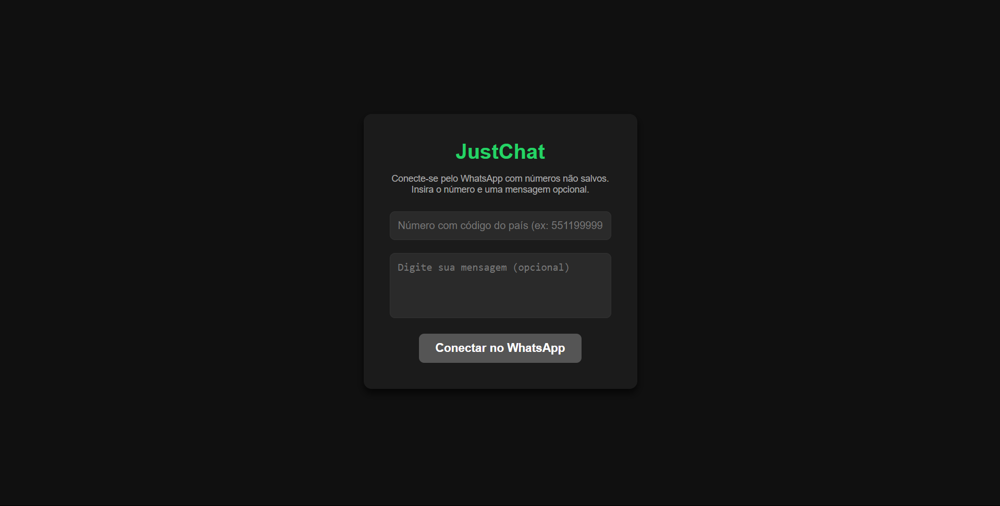

# JustChat

JustChat é uma ferramenta simples que permite que você envie mensagens para números não salvos no WhatsApp Web. Basta inserir o número e, opcionalmente, uma mensagem, e o chat será aberto com o número não salvo.

---

## 🛠️ Funcionalidades

- **Envio rápido de mensagens**: Conecte-se pelo WhatsApp sem salvar o número na agenda.
- **Mensagem opcional**: Adicione uma mensagem personalizada ou inicie um chat vazio.

---

## 🚀 Como usar

1. Baixe o arquivo `justchat.html` do repositório.
2. Abra o arquivo no seu navegador preferido.
3. Certifique-se de que você está **logado no WhatsApp Web** no mesmo navegador.
4. Siga os passos:
   - Insira o número de WhatsApp no formato internacional (ex: `5511999999999`).
   - Digite uma mensagem (opcional).
   - Clique no botão **Conectar no WhatsApp**.
5. O chat será aberto em uma nova aba!

---

## 📋 Requisitos

- Um navegador moderno (Google Chrome, Firefox, Edge, etc.).
- A conta do WhatsApp Web deve estar ativa e logada no navegador.

---

## 🎨 Captura de Tela

---

## 🛡️ Segurança

- Este projeto não coleta nem armazena dados de usuários.
- Todas as informações são processadas localmente no navegador.

---

## 📄 Licença

Este projeto está sob a licença [MIT](./LICENSE). Sinta-se à vontade para usá-lo e modificá-lo como preferir.

---

## 🌐 Links úteis

- [WhatsApp Web](https://web.whatsapp.com)

